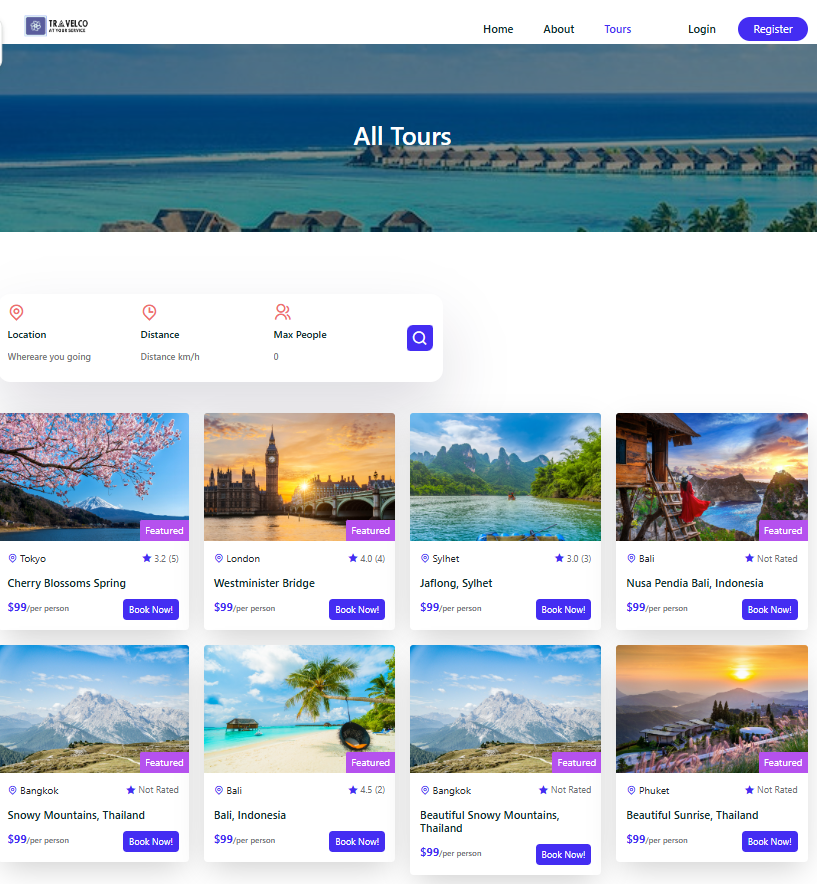
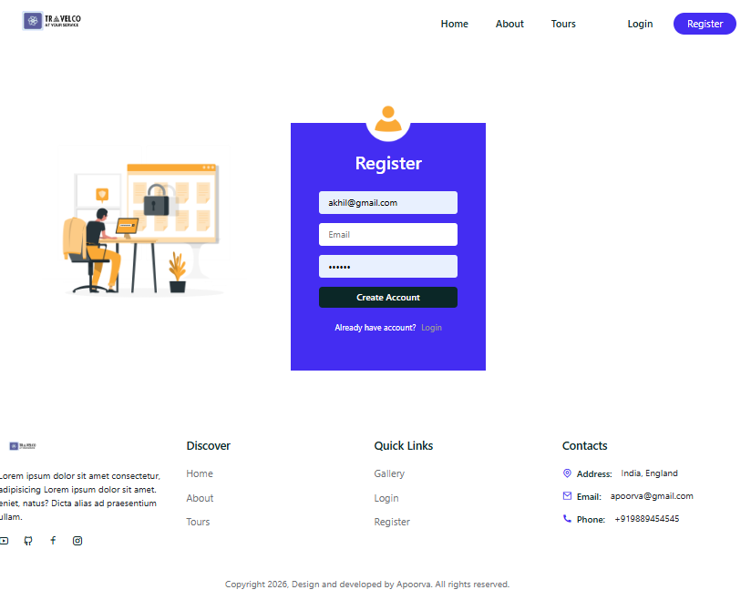

# TravelCo

A full-stack travel booking web application built with React (frontend) and Node.js/Express + MongoDB (backend).

## Tech Stack

- Frontend: React, React Router, Bootstrap, Reactstrap
- Backend: Node.js, Express, MongoDB, Mongoose
- Auth: JWT + cookies

## Project Structure

```text
TravelCo-master/
  frontend/   # React client
  backend/    # Express API + MongoDB models/routes/controllers
  screenshots/ # README images (add your screenshots here)
```

## Screenshots

Add your website images inside the `screenshots/` folder, then keep these paths as-is:

### Home Page


### Tours Page


### Login Page


## Prerequisites

- Node.js (v16+ recommended)
- npm
- MongoDB connection string (local MongoDB or MongoDB Atlas)

## Environment Variables

Create a `.env` file inside `backend/` with:

```env
MONGO_URI=your_mongodb_connection_string
JWT_SECRET_KEY=your_jwt_secret
PORT=4000
```

`PORT=4000` is recommended because frontend API config points to `http://localhost:4000/api/v1`.

## Install Dependencies

### Backend

```bash
cd backend
npm install
```

### Frontend

```bash
cd frontend
npm install
```

## Run the Application

Open two terminals:

### Terminal 1: Start backend

```bash
cd backend
npm run start-dev
```

or

```bash
npm start
```

### Terminal 2: Start frontend

```bash
cd frontend
npm start
```

## App URLs

- Frontend: `http://localhost:3000`
- Backend API base: `http://localhost:4000/api/v1`

## Available Scripts

### Backend (`backend/package.json`)

- `npm start` -> run server with Node
- `npm run start-dev` -> run server with Nodemon

### Frontend (`frontend/package.json`)

- `npm start` -> start React dev server
- `npm run build` -> production build
- `npm test` -> run tests

## API Route Prefixes

Backend mounts these route groups under `/api/v1`:

- `/auth`
- `/tours`
- `/users`
- `/review`
- `/booking`

## Notes / Troubleshooting

- If frontend cannot reach backend, verify:
  - backend is running
  - `PORT` in backend matches frontend `BASE_URL`
- If MongoDB fails to connect, check `MONGO_URI` in `backend/.env`.
- If auth fails, check `JWT_SECRET_KEY` is set.
- If CORS issues appear, review CORS origins in `backend/index.js`.

## License

ISC
